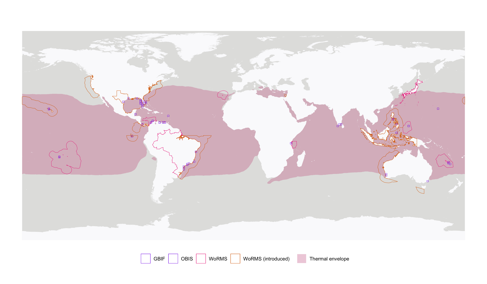
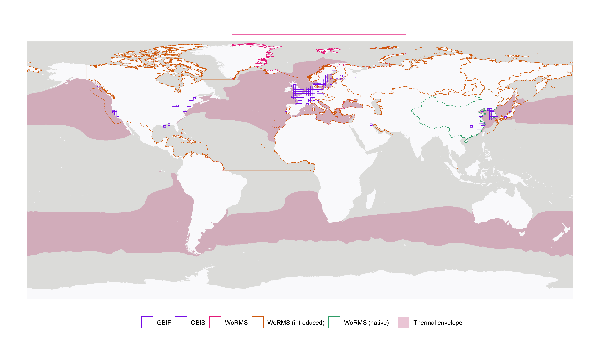

# speedy

This package fetches and summarizes marine species distributions based
on OBIS, GBIF, and WoRMS. It also calculates thermal envelopes using
Bio-ORACLE sea surface temperature data.

## Installation

``` r
remotes::install_github("iobis/speedy")
```

## Summary distribution map

``` r
library(speedy)

scientificname <- "Didemnum perlucidum"
didemnum <- get_dist(scientificname = scientificname)
plot_dist(didemnum, title = scientificname)
```

<!-- -->

``` r
scientificname <- "Eriocheir sinensis"
eriocheir <- get_dist(scientificname = scientificname)
plot_dist(eriocheir, title = scientificname)
```

<!-- -->

## Temperature envelope

``` r
plot_kd(didemnum$envelope)
```

<!-- -->

``` r
plot_kd(eriocheir$envelope)
```

<!-- -->
